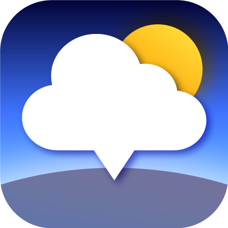
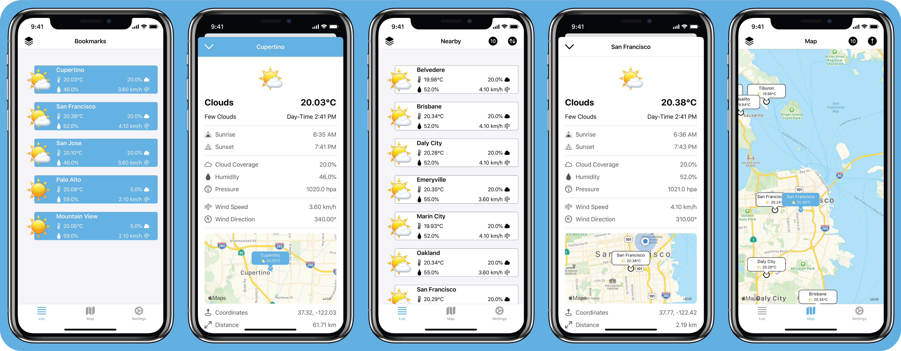

<h1 align="center">NearbyWeather</h1>
<h6 align="center">by Erik Maximilian Martens</h6>

 

  <a href="#about-the-app">About the App</a> •
  <a href="#supported-languages">Supported Languages</a> •
  <a href="#app-releases">App Releases</a> •
  <a href="#how-to-contribute">How to Contribute</a> •
  <a href="#technical-support">Technical Support</a> •
  <a href="#contact-information">Contact Information</a>

  

---

## About the App

> ❗️ By using the app you automatically agree to the [privacy policy](PRIVACYPOLICY.md) and the [terms of use](TERMSOFUSE.md).

> ❗️Please note that you need to supply your own OpenWeatherMap API key, in order to use the app.

NearbyWeather provides current weather information for for bookmarked weather stations, as well as nearby weather stations. The app uses the OpenWeatherMap API to download weather data.

## Supported Languages

| English (US) | German | French | Chinese (Traditional) |
|:--|:--|:--|:--|
| 🇺🇸 | 🇩🇪 | 🇫🇷 | 🇨🇳 |

## App Releases

Release notes for past version are documented in this repository. Future releases are documented as well outlining the planned changes. If you want to suggest a feature, you can submit a new issue for triage.

| Type | Version | Release Date |
|:--|:--|:--|
| Current Release | [2.2.1](Releases/version_2_2_1.md) | Dec 31 2020 |
| Next Release | [3.0.0]() | _N/A_ |

## How to Contribute

### Bug Report

Did you find something wrong with the app? We are looking forward to receiving your reports. You can find out how to take report an issue via the [issue creation guidelines](ISSUECREATIONGUIDELINES.md).

### Feature Request

Do you need the app to do more for you? We are looking forward to hearing about your ideas. You can find out how to submit a feature request via the [feature request guidelines](FEATUREREQUESTGUIDELINES.md).

### Translations

Localizing the app for additional languages is another great way to contribute. Please create an issue for your chosen language and follow the [contribution guidelines](CONTRIBUTING.md). Otherwise get into contact in order to be introduced to the procedure.

### Beta Testing

You may also assist as a beta tester. Periodically test-builds will become available via Testflight. In order to take part in testing those submit an email address used as an Apple-ID to [erikmartens.dev@icloud.com](mailto:erikmartens.dev@icloud.com) to be added to the list of testers.

## Technical Support

If you are having technical issues or want to raise a bug/issue with the app, the preferred way is through Discord. Refer to the contact section to find out how to get in touch.

## Contact Information

| Platform | Link |
|:--|:--|
| Discord |  |
| Twitter |  |
| Email |  |

